# Moving Platform Maker 2D

The best Unity asset to help you create 2D moving platforms without coding.

## Development version

Our default branch is for the development of the new version of the asset and requires Unity  2022.3.13f1 or greater.

There are specific branches for each LTS version of Unity supported and those currently contain the released versions of the asset.

## Table of contents

- [Quick start](#quick-start)
- [Features](#features)
- [The editor](#the-editor)
- [Credits](#credits)
- [Contributing](#contributing)
- [Creators](#creators)
- [Thanks](#thanks)

## Quick start

Download it directly from Unity's asset store, the best version for your current Unity version is automatically chosen and you will receive notifications when it is updated.

For development, clone the repo into your project's `Assets` folder. It should create a folder called `MovingPlatformMaker2D`.

## Features

The traditional "ping-pong":

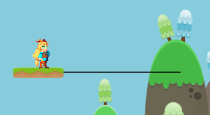

Smooth movements with easing curves:

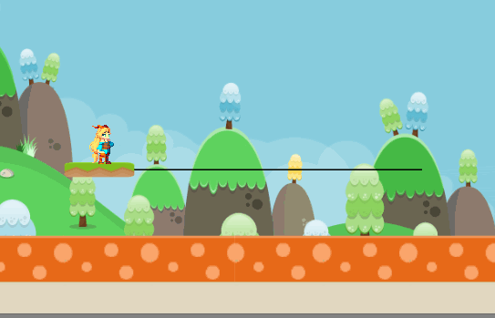

Loops:

Enter and leave tracks:

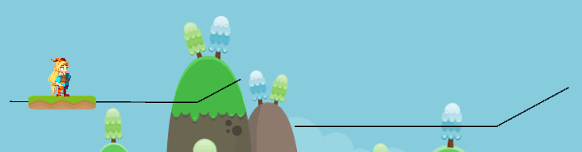

Tracks can be connected to other tracks and can be interchanged:

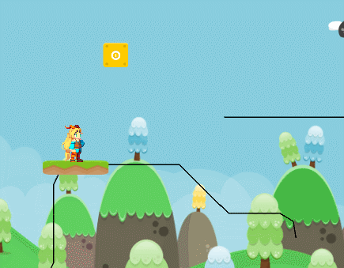

And it doesn't work only for platforms.
You can animate anything, such as enemies...

and saw blades:

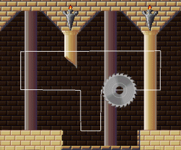

Or have multiple entities on a track:

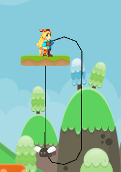

Platform activated on the first touch:

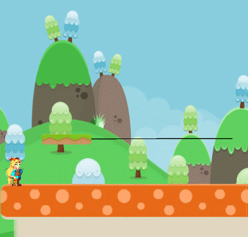

Active only when the player is on it...

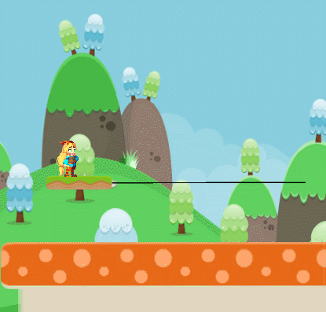

...and switching directions every time:

Platform activated from a trigger area:

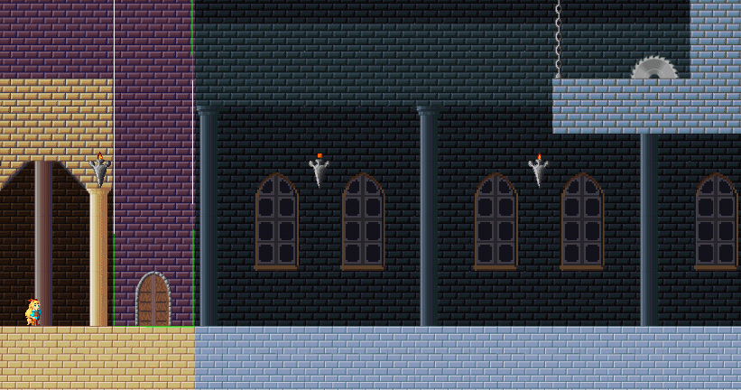

There are also circular platforms:

And falling platforms:

## The editor

Here are the main scripts you need to know:

### Path (Script)

A track is called a Path. Here is how you can create a Path:

A Path consists of:

#### Edit button (deprecated):

The edit button enables the Path editor, where you can add, remove, and move points of the Path.

In the current development version (2.x) this button is not present. By selecting the GameObject it will automatically enter Edit mode.

- Editing and moving points:

- Adding new points:

Hold **Shift** and click on the position you want to add the new point. (This option is not available when the path is Cyclic.)

- Adding points in the middle:

For adding points to the middle of the path, hold **Shift** and click on the circles that appear between the existent points.

- Removing points:

Hold **Ctrl** and click on the points you want to remove.

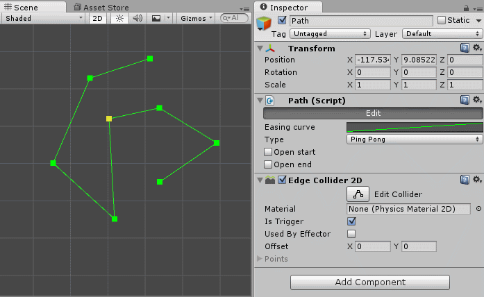

#### Easing curve

The smoothness of the movement can be adjusted by editing the easing curve of the Path. It is recommended for ping-pong movements, for open and connected Paths a straight line is a better option to avoid strange movements.

Examples:

- Straight line:

- Sigmoid. Makes the movement faster in the middle and slower at the ends.

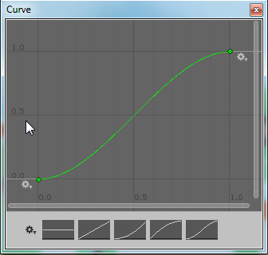

#### Type

There are essentially 3 types of Paths:

- Ping-pong

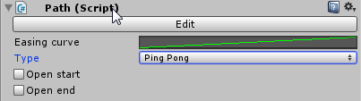

By default it is "closed" but it can be open at the start, the end, or both. Being open means that the platform can fall when reaching one of the boundaries.

Open at the start:

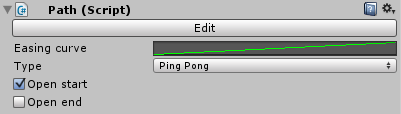

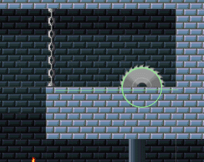

Open at the end:

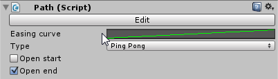

- Cyclic

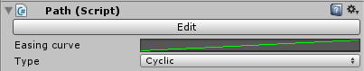

- Connected

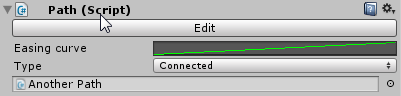

Connected path video example: https://youtu.be/KatA-7SuL_I

### PathFollower (Script)

The PathFollower is a script that can be added to a GameObject to follow a Path. It can be a platform, enemy, object, etc.

How to create a PathFollower:

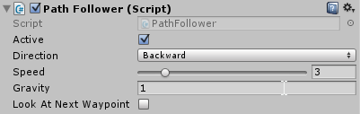

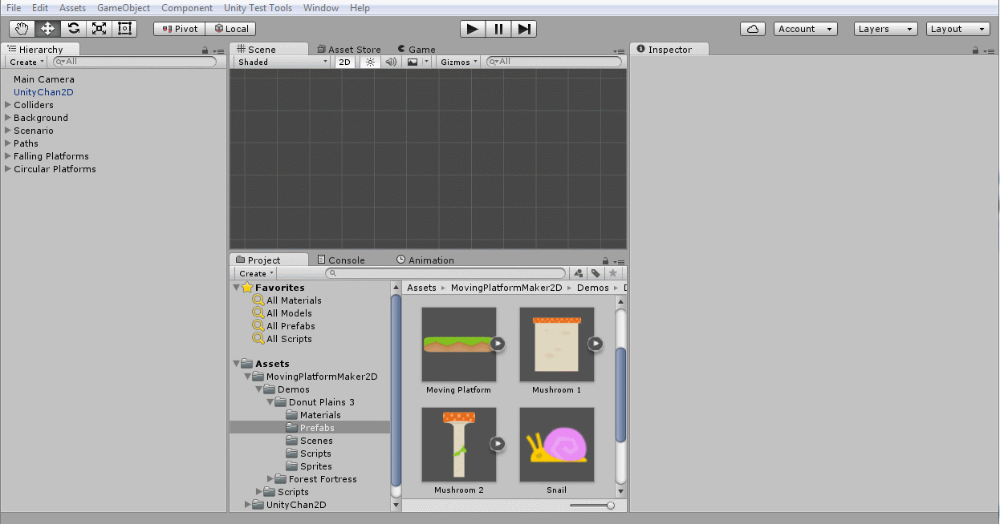

The properties of a PathFollower are:

- **Active**: defines whether this object is active in following a Path or not. This is commonly used for keeping it still (inactive) until the player reaches a trigger area.

- **Direction**: defines the direction that the object will move in the path - Forward (from start to end) or Backward (from end to start). In a ping-pong path, the direction changes when the follower reaches the boundaries.

- **Speed**: the relative speed of the object. Default to 1.

- **Gravity**: the gravity acceleration of the object when leaving the path. It has its acceleration independent of the unity physics system.

- **Look at next waypoint**: useful for enemies, when following a Path it turns its front (X-axis) facing the direction of the next waypoint of the Path. Example:

### PathFollowerTrigger (Script)

It is used to activate a path follower when the player (or any other object) enters the trigger area. This script also requires a Collider2D as a trigger.

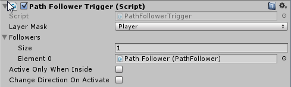

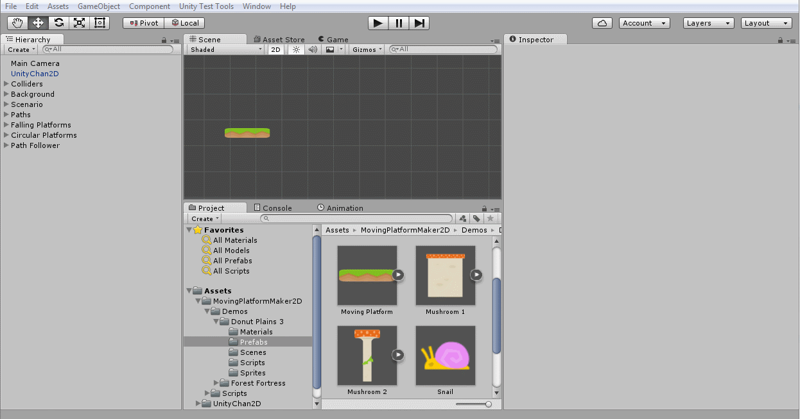

Example of a trigger in action: https://youtu.be/jObUKdQncMc

The properties of a PathFollowerTrigger are:

- **LayerMask**: defines which layers can interact with the trigger. E.g.: Player

- **Followers**: a list of PathFollowers that will be activated when the trigger is fired

- **Active only when inside**: if checked the followers will only be active when the player is inside the trigger area, otherwise the followers will be activated when the trigger is fired the first time

- **Change direction on activate**: every time the trigger is activated it will change the follower's direction

### CircularPlatform (Script)

There is a special script for creating circular platforms:

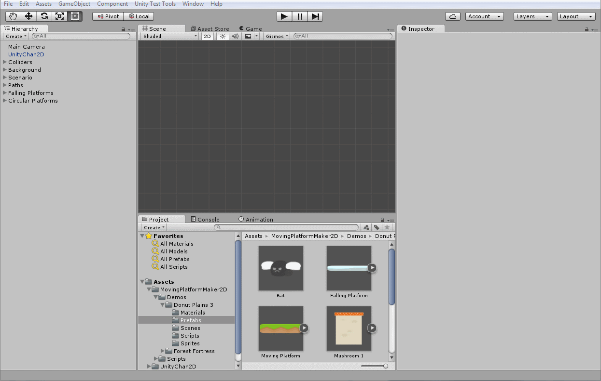

The properties of a CircularPlatform are:

- **Gizmo color**: the color of the circle gizmo, useful to visualize the circular path

- **Degrees per second**: the angular velocity of the platforms in degrees per second

- **Radius**: the radius of the circle

- **Number of platforms**: the number of platforms that will be instantiated

- **Platform prefab**: the platform prefab that will be used to create platform objects

### MovingPlatform (Script)

An auxiliary script that can be added to the platform object and is responsible for carrying the player. It doesn't support Unity's physics system. It will make the player a child of the platform while they're in contact with each other.

### FallingPlatform (Script)

Added to a platform object, it sets a delay to fall after being touched by the player.

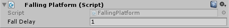

### Decorators

The paths by default are not rendered in the scene view or game view, but two decorators can help with visualizing the paths. Just add the respective script to the Path game object.

- **PathGizmosDecorator** (Script): It shows the path in the scene view in the editor as a gizmo

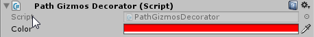

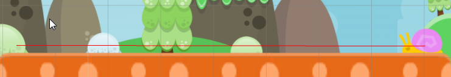

- **PathLineDecorator** (Script): It creates a line renderer to show the path in the scene and game views. (The black line in the example)

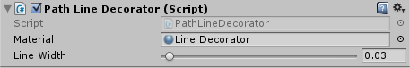

## Credits

The demo scenes were inspired by Super Mario World's levels to showcase the use of moving platforms. You can play them online:
- [Donut Plains](https://l9studios.com/demos/donutplains/)
- [Forest fortress](https://l9studios.com/demos/forestfortress/)

All the images and music are open source and the sources are listed in the credits section below.

### Unity Chan 2D

The demo scenes were created using the Unity-Chan 2D asset which is not included in this asset and repository. Unity-Chan is a copyright © Unity Technologies Japan/UCL. The Unity-Chan package can be downloaded [here](https://unity-chan.com/download/releaseNote.php?id=UnityChan2D&lang=en). Please read the [license terms](http://unity-chan.com/contents/license_en/) before using it for any purpose.
To make it easier to achieve the same results, below are the configurations for each scene. Just add Unity-Chan 2D prefab to the scene and configure it as the screenshots.

### Donut plains

Music:

http://opengameart.org/content/jump-and-run-8-bit

Sprites:

http://opengameart.org/content/platformer-art-mushroom-land

http://opengameart.org/content/platformer-art-deluxe

http://opengameart.org/content/2d-backgrounds-set

Unity-Chan configs:

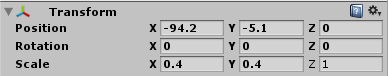

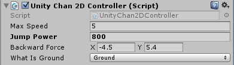

### Forest fortress

Music:

http://opengameart.org/content/the-forgotten-forest

Sprites:

http://opengameart.org/content/pixel-art-castle-tileset

https://commons.wikimedia.org/wiki/File:Circularsawblade.png

http://opengameart.org/content/16x16-and-animated-lava-tile-45-frames

https://openclipart.org/detail/22293/cartoon-rhino

Tiles:

https://www.assetstore.unity3d.com/en/#!/content/20203

Unity-Chan configs:

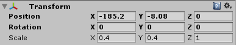

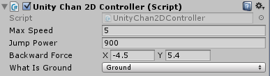

## Contributing

You can contribute by forking this repo and submitting a PR.

Don't know where to start, please have a look at the current open issues.

Found a bug? The issue tracker is the best place. Some tips to follow:

- Check if there's already an issue open before opening a new issue
- Add as much detail as possible, unity version, steps to reproduce
- Isolate the problem by reproducing it in a new empty scene

## Creators

**Alexandre Betioli**

- <https://github.com/apbetioli>

**Thiago Marques**

- <https://github.com/redthi>

## Thanks

Thanks to all early users of the asset for the help with funding it and for all your feedback.
