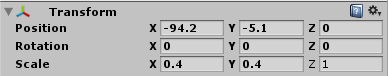
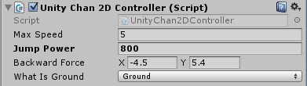
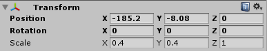
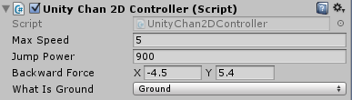

## Credits

All the images and music are open source and the sources are listed in the credits section below.

### Unity Chan 2D

The demo scenes were created using the Unity-Chan 2D asset which is not included in this asset and repository. Unity-Chan is a copyright © Unity Technologies Japan/UCL. The Unity-Chan package can be downloaded [here](https://unity-chan.com/download/releaseNote.php?id=UnityChan2D&lang=en). Please read the [license terms](http://unity-chan.com/contents/license_en/) before using it for any purpose.
To make it easier to achieve the same results, below are the configurations for each scene. Just add Unity-Chan 2D prefab to the scene and configure it as the screenshots.

### Donut plains

Music:

http://opengameart.org/content/jump-and-run-8-bit

Sprites:

http://opengameart.org/content/platformer-art-mushroom-land

http://opengameart.org/content/platformer-art-deluxe

http://opengameart.org/content/2d-backgrounds-set

Unity-Chan configs:

### Forest fortress

Music:

http://opengameart.org/content/the-forgotten-forest

Sprites:

http://opengameart.org/content/pixel-art-castle-tileset

https://commons.wikimedia.org/wiki/File:Circularsawblade.png

http://opengameart.org/content/16x16-and-animated-lava-tile-45-frames

https://openclipart.org/detail/22293/cartoon-rhino

Tiles:

https://www.assetstore.unity3d.com/en/#!/content/20203

Unity-Chan configs:

