## Features

### Ping Pong

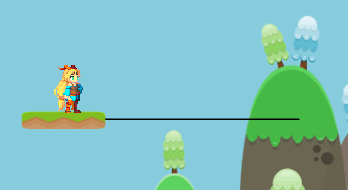

Smooth movements with easing curves:

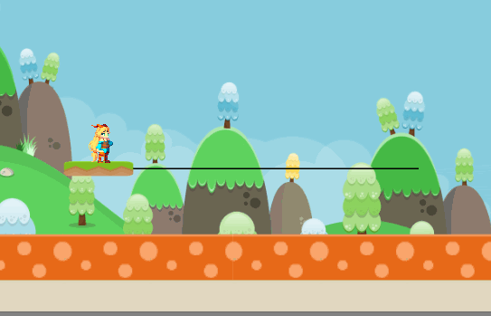

### Loops

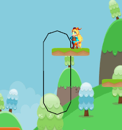

### Enter and leave tracks

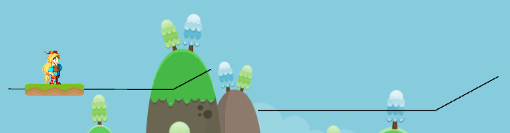

### Connections

Tracks can be connected to other tracks and can be interchanged:

And it doesn't work only for platforms.
You can animate anything, such as enemies...

### Animations

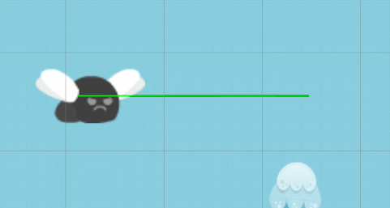

and saw blades:

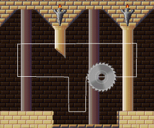

Or have multiple entities on a track:

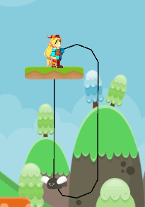

### Triggers

Platform activated on the first touch:

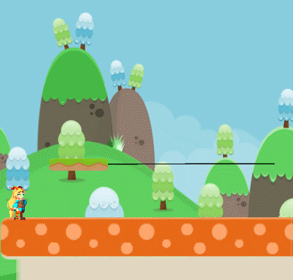

Active only when the player is on it...

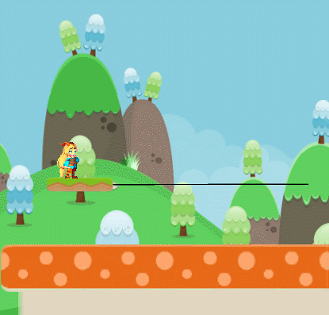

...and switching directions every time:

Platform activated from a trigger area:

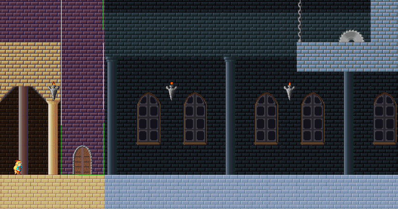

### Circular platforms

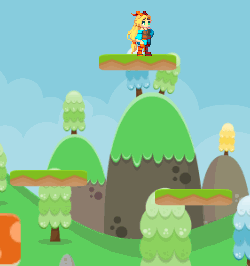

### Falling platforms

