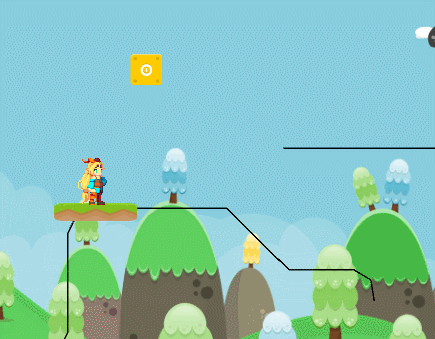

## Features

### Ping Pong

Smooth movements with easing curves:

### Loops

### Enter and leave tracks

### Connections

Tracks can be connected to other tracks and can be interchanged:

And it doesn't work only for platforms.
You can animate anything, such as enemies...

### Animations

and saw blades:

Or have multiple entities on a track:

### Triggers

Platform activated on the first touch:

Active only when the player is on it...

...and switching directions every time:

Platform activated from a trigger area:

### Circular platforms

### Falling platforms

