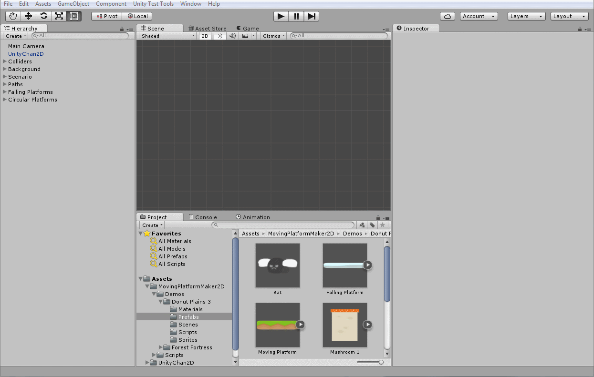
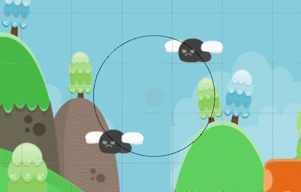

### CircularPlatform (Script)

There is a special script for creating circular platforms:

The properties of a CircularPlatform are:

- **Gizmo color**: the color of the circle gizmo, useful to visualize the circular path

- **Degrees per second**: the angular velocity of the platforms in degrees per second

- **Radius**: the radius of the circle

- **Number of platforms**: the number of platforms that will be instantiated

- **Platform prefab**: the platform prefab that will be used to create platform objects