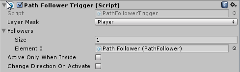
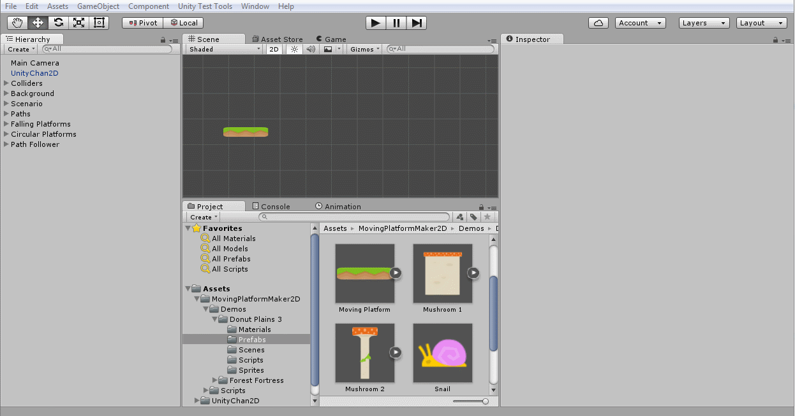

### PathFollowerTrigger (Script)

It is used to activate a path follower when the player (or any other object) enters the trigger area. This script also requires a Collider2D as a trigger.

Example of a trigger in action: https://youtu.be/jObUKdQncMc

The properties of a PathFollowerTrigger are:

- **LayerMask**: defines which layers can interact with the trigger. E.g.: Player

- **Followers**: a list of PathFollowers that will be activated when the trigger is fired

- **Active only when inside**: if checked the followers will only be active when the player is inside the trigger area, otherwise the followers will be activated when the trigger is fired the first time

- **Change direction on activate**: every time the trigger is activated it will change the follower's direction
