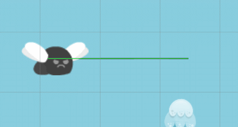

### PathFollower (Script)

The PathFollower is a script that can be added to a GameObject to follow a Path. It can be a platform, enemy, object, etc.

How to create a PathFollower:

The properties of a PathFollower are:

- **Active**: defines whether this object is active in following a Path or not. This is commonly used for keeping it still (inactive) until the player reaches a trigger area.

- **Direction**: defines the direction that the object will move in the path - Forward (from start to end) or Backward (from end to start). In a ping-pong path, the direction changes when the follower reaches the boundaries.

- **Speed**: the relative speed of the object. Default to 1.

- **Gravity**: the gravity acceleration of the object when leaving the path. It has its acceleration independent of the unity physics system.

- **Look at next waypoint**: useful for enemies, when following a Path it turns its front (X-axis) facing the direction of the next waypoint of the Path. Example:

