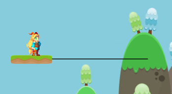
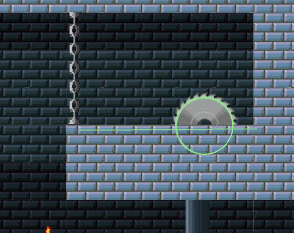
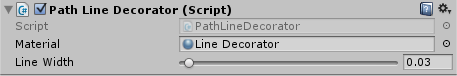

### Path (Script)

A track is called a Path. Here is how you can create a Path:

A Path consists of:

#### Edit button (deprecated):

The edit button enables the Path editor, where you can add, remove, and move points of the Path.

In the current development version (2.x) this button is not present. By selecting the GameObject it will automatically enter Edit mode.

- Editing and moving points:

- Adding new points:

Hold **Shift** and click on the position you want to add the new point. (This option is not available when the path is Cyclic.)

- Adding points in the middle:

For adding points to the middle of the path, hold **Shift** and click on the circles that appear between the existent points.

- Removing points:

Hold **Ctrl** and click on the points you want to remove.

#### Easing curve

The smoothness of the movement can be adjusted by editing the easing curve of the Path. It is recommended for ping-pong movements, for open and connected Paths a straight line is a better option to avoid strange movements.

Examples:

- Straight line:

- Sigmoid. Makes the movement faster in the middle and slower at the ends.

#### Type

There are essentially 3 types of Paths:

- Ping-pong

By default it is "closed" but it can be open at the start, the end, or both. Being open means that the platform can fall when reaching one of the boundaries.

Open at the start:

Open at the end:

- Cyclic

- Connected

Connected path video example: https://youtu.be/KatA-7SuL_I

#### Decorators

The paths by default are not rendered in the scene view or game view, but two decorators can help with visualizing the paths. Just add the respective script to the Path game object.

##### PathGizmosDecorator (Script)

It shows the path in the scene view in the editor as a gizmo

##### PathLineDecorator (Script)

It creates a line renderer to show the path in the scene and game views. (The black line in the example)

